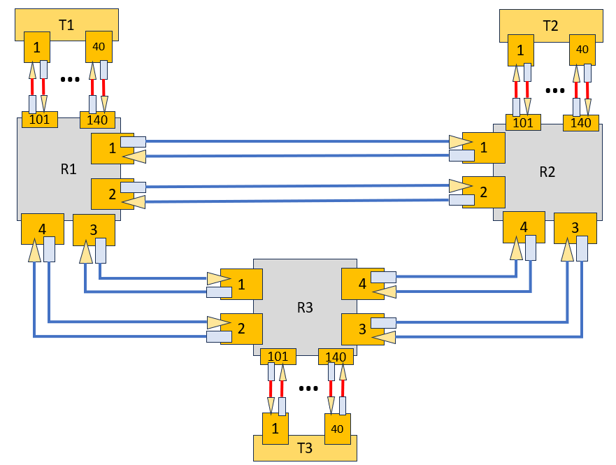

# optical-controller
This a framework to implement the optical controller for the RMSA algorithm.
#create a venv
python -m venv venv

in linux
source venv/Scripts/activate

in windows
venv\Scripts\activate

pip install -r requirements_opt.txt

python OpticalController.py

